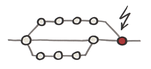
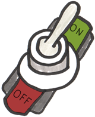

I have worked with [Git Flow](http://nvie.com/posts/a-successful-git-branching-model/) for a few years and it helped me a lot to structure my [Git](https://git-scm.com/) branches. However, I have encountered some problems with Git Flow, most of them coming from long-living branches. The solution to solve those problems is *trunk based development*! It is an amazingly simple technique which is also the base for effective continuous delivery. In this article I tell you how I have made the transition from Git Flow to trunk based development with my iOS development team at [HolidayCheck](https://www.holidaycheck.de/). You will learn what is the most important step to get there and what benefits you will get from trunk based development, so keep on reading!

## The Problems with Git Flow
### Merge Conflicts
{: .img-align-right}
Merge conflicts are very common when you work with Git Flow. The reason is simple: If you have multiple parallel feature branches which live for a long time then it is very likely that the same part of the code base is changed in two different branches. Merge conflicts are not only frustrating for the developer who has to solve them manually. They also increase the risk of breaking something in your code because it is easy to make a mistake when you have to decide which code to use and which not. Even if you do everything right when you merge one branch into another it can happen that the combination of two features breaks your code.

### Feature Separation
You cannot test the combination of two features until they are merged into one branch. When you develop features in separate branches for multiple days or even weeks then problems which arise from the interaction of two features become visible late. When you react late on those problems you will probably have to change more parts of the code you have written for the new features. That means you have wasted more time creating code you don’t need any more.

Many different feature branches can also be confusing for the manual testers of your software. They always have to know in which staging environment the new feature can be found. Different staging environments normally also mean different build jobs, different screens for monitoring the jobs and so on.

### The Unpredictable Release
There is another problem with Git Flow which is a result of the two points above: It is impossible to know how much time you will need for a release if the feature branches are not merged yet. You cannot know it because you don’t know which merge conflicts will occur and you also don’t know how the different new features will influence each other. Not being able to release at any time makes you inflexible and unreliable.

## The Solution: Trunk Based Development
Great news! There is a solution for all the problems above and it is called *trunk based development*. You only have one main branch, the *trunk* (also called *master* or *mainline*). There is no *develop* branch anymore. Also no long-living feature branches! All your commits are merged into the trunk as soon as possible, at least once a day. By merging to the trunk so quickly, merge conflicts become very rare. Using short-living branches is one of the [4 Simple Tricks to Avoid Merge Conflicts](https://team-coder.com/avoid-merge-conflicts/). Even if you get a merge conflict it will probably be easy to solve because the set of changes since the last merge to the trunk is not so big. Interferences between different features become visible immediately and can be tested while the features are still in progress.

Trunk based development will also encourage your team to think and work in small steps which lead to small commits that can be merged to the main branch quickly. Usually small steps reduce the number of bugs and help to create a modular design.

The big question is: How can you avoid to get an unstable master branch if you push your code into it every day, even if a feature is not finished, yet? Read on to get the answer…

## How to Get from Git Flow to Trunk Based Development
### Feature Toggles
When I introduced trunk based development to my team at HolidayCheck there was one first step which was absolutely necessary in order to be able to commit to the trunk quickly! Before we even started to change our branching structure we had to make sure that we can make very short-living branches that can be merged into the develop branch as quickly as possible. The solution is rather simple! We started to use feature toggles – little switches in the source code that decide whether a feature is active or not.

```swift
if ( FeatureManager.isFeatureEnabled("NewLoginForm") )
{
    openNewLoginForm()
}
else
{
    openOldLoginForm()
}
```

{: .img-align-right}
As long as a feature is not ready to be released, it is disabled. That allows us to already push it into the develop branch without breaking anything. Developers and manual testers can enable every feature in some settings which are hidden to the normal users. The develop branch is always ready to be released because the unfinished features are switched off. They will be shipped to the user but they will not be visible. As soon as a feature is finished it is turned on and available with the next release.

When we had those feature toggles in our code we realized that they are not only useful while the features are being developed! It would be great to keep the toggles in the code even when the features are finished. If we had a possibility to control the toggles remotely for all our users then we would be able to deactivate a feature quickly whenever we see that it has a bad impact on our conversion rates or other key numbers. Also if any bugs occur or the traffic load for our servers becomes too high, we are always able to switch off the feature immediately. This is especially important as we have to wait multiple days until Apple reviews and excepts a new release of our iOS app. Being able to disable features without a new release is a very powerful weapon!

Now, with all the feature toggles set up, there is another great thing we can do: **A/B testing**! Since every feature toggle can be controlled remotely we have the possibility to enable a feature only for a part of our user base and disable it for the others. Doing that we can see how well a feature really performs. We can test new features on small test groups and then decide whether we should enable it for everybody or remove it if we see a negative impact. We use [Optimizely](https://www.optimizely.com/) to control and evaluate our A/B tests but there are also other tools available.

### One Branch to Rule Them All
Now that we are able to merge our feature branches into the develop branch quickly (because unfinished features are deactivated), we are able to release the develop branch at any time. The question is: Do we still need a develop *and* a master branch? The answer is: No. We can commit everything directly into the master instead of the develop branch. The master is always ready for production (don’t forget to run all your tests whenever something is pushed into the master ;-)). If we want to create a release version we can either do it directly from the master branch or create a release branch for that. The latest released commit is marked with a Git tag. So the second step after introducing feature toggles is to **delete the develop branch**! And here we are! This is already trunk based development!

## Take Aways
Trunk based development has made my team much more flexible. We can release our master branch at any time and we have no big merge conflicts anymore. A master branch that is always ready to be released to production is the prerequisite for continuous delivery. The feature toggles are the prerequisite for A/B testing. They help us to find out what our users really want and make us more confident because we know that we can disable a feature at any time. The result is smaller risk and more innovation.