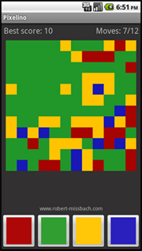
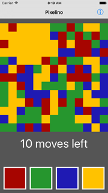

I bought my first Smartphone in 2011. It was an HTC Desire with Android running on it. A few weeks earlier I had started to learn Java so since Android apps can also be developed with Java I had to create an app for that great device! Now, five years later, I’m building the same app again but with new technologies. My goal is to train my skills. In this article I want to tell you how I improve my skills as a software developer with that pet project and how you can do the same with your own little project!

## What is a Pet Project?

A pet project is a little side project which is independent from your actual work. You can use it to practice the skills that you want to improve as a software developer, e.g. a new programming language, new design patterns or any other technologies and workflows. In the next two chapters I will tell you about my favorite pet project and what I use it for. You will also learn why pet projects are so effective.

## My First Android App

{: .img-align-right}
I will never forget the day when I bought my first Smartphone! Until that day I had only developed software for desktop computers or pocket calculators. I loved the idea to create an app which is always available on the device right in my pocket! Naturally, the first thing I did after trying out my new Smartphone was to read some tutorials about Android app development. After I successfully created the “Hello World” app I already started a real project: a mini game called Pixelino! A few weeks later I had a first version of that game finished and I released it in the Android Market (which is the Google Play Store today). During the developing process I improved my Java skills and learned how to use the Android SDK. I still remember that great feeling when my app got some good ratings and more and more people all over the world downloaded it. That pushed my motivation to improve Pixelino further and I continued extending the app and improving my skills more and more.

A few months later the company I was working for wanted me to develop an app for iOS so I started learning how to create apps for Apple’s mobile operating system. Since I was falling in love with that new platform I didn’t continue on Pixelino and concentrated on iOS development. However, [Pixelino](https://play.google.com/store/apps/details?id=com.missbach.pixelino) is still available in the Google Play Store.

## Again But Different

{: .img-align-left}
Now, five years later, I am starting to build Pixelino again. Why? Well, definitely not to earn money with the app but to train my skills. But this time those skills are different ones: I want to practice programming [Swift](https://swift.org/), the great programming language that will probably replace Objective-C within the next years. In addition to that it is also a nice opportunity to get better at Test-Driven Development and automating as many things as possible, including the release process.

The great thing is that there is an actual outcome of all this practicing! Unlike a code kata which is thrown away after doing it, Pixelino is something that can be released in the App Store! This is awesome because it is so motivating! This motivation helps me to continue working on that project. Ah, and of course I am very proud to provide you the links to [Pixelino on GitHub](https://github.com/packatino/pixelino) and [Pixelino in the iOS App Store](https://t.co/MfNtYvS5Bk) ;-)

## Why Pet Projects Are so Effective

There are many ways to practice your skills as a software developer. The internet is full of tutorials that show you how to implement something that has been implemented by thousands of developers before. That can be helpful for the first steps but it doesn’t always encourage you to think by yourself and to deeply understand what you are doing.

Another thing that many programmers do is *code katas* – a small exercise that is done again and again until the programmer has found the best solution and can implement it very fast. I have done a few of those katas but I have to admit that it is not always easy to motivate me to do the same thing again and again. Also the outcome of such katas is usually nothing you could use in the real life.

In my [initial post](https://team-coder.com/the-team-coder/) for this blog I wrote about the importance of working together with other people in order to improve. I still think this is absolutely true. However, it can be helpful to take some time for yourself to try out a few things. Like a little child that has to touch the hot stove to really understand why it shouldn’t touch it again. Working alone without any pressure allows you to try out all the things you want which is a good base for learning. Remember, your pet project should be an addition to your daily work. It won’t replace learning from your team mates.

A pet project forces you to think about every detail by yourself. At the same time it is much more motivating than a code kata because the outcome can be used by other people. There is something you can give to the community (think about the karma points ;-)). The users will give you feedback that helps you to improve further. For me, Pixelino is a valuable addition to my daily work in my team. It is fun to work on it and it really helps me to improve my skills and to learn new things.

## Start Your Own Pet Project

Do you already have a pet project? That’s great! Tell me about it on Twitter! If you don’t have a pet project, yet, I hope this blog post motivates you to start one ;-)
