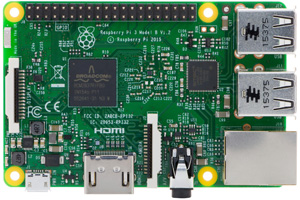

I have built a [Twitter](https://twitter.com/socrabot_) bot which searches Twitter for tweets about software craftsmanship and retweets them if they are interesting. In this tutorial I will tell you how you can easily build your own Twitter bot with Python and run it on a Raspberry Pi or any other Unix system!

## Preparation

### Creating an Account for the Twitter Bot
If you want to have a bot user on Twitter the first thing you have to do is [creating an account](https://twitter.com/signup) for it. When you are logged in with your new bot account you have to set up a new app on the [Twitter Application Management website](https://apps.twitter.com/app/new). Your bot will use this new app to communicate with the Twitter API later. You don’t need to provide a callback URL. After creating the app on Twitter you can leave the website and continue with the next step.

### Installing the Dependencies
For this tutorial I assume that Python is already installed on your machine. There is only one more thing you have to prepare: Installing a library that makes it easy to connect to the Twitter API. There are multiple Python libraries for doing that. For my Twitter bot I use a very lightweight one called [Twython](https://github.com/ryanmcgrath/twython). You can install it with your favorite command line tool with the following command:

```bash
$ pip3 install twython
```

### Setting up the Git Repository

Having your code in a Git repository is always a good idea. For the bot that you will build it is particularly important. Create a new Git repository for it and push it to a platform like [GitHub](https://github.com/).

## Tweeting Hello World with Python

{: .img-align-left}
TwitterNow that all the preparation is done the fun part can begin: Writing the code for your Twitter bot! First create the Python file which will contain the source code. Call it *tweetbot.py*. Then use your favorite Python editor (I recommend PyCharm) to write the following code into your Python file:

```python
from twython import Twython

API_KEY = 'YOUR TWITTER API KEY'
API_SECRET = 'YOUR TWITTER API SECRET'
ACCESS_TOKEN = 'YOUR TWITTER ACCESS TOKEN'
ACCESS_TOKEN_SECRET = 'YOUR TWITTER ACCESS TOKEN SECRET'

twitter_client = Twython(API_KEY, API_SECRET, ACCESS_TOKEN, ACCESS_TOKEN_SECRET)
twitter_client.update_status(status='Hello World!')
```

Go back to your application page on the Twitter website. There should be a tab called “Keys and Access Tokens”. On that page you will find the values for your API key, API secret, access token and access token secret. Use them in your Python script! The Twitter API needs them to identify your bot.

If you now run the script you will see the new tweet on the timeline of your bot user :)

Take your time to implement your own features for the bot! There are so many things that a Twitter bot could do!

## Setting up a Raspberry Pi for the Twitter Bot

{: .img-align-right}
Raspberry PiI assume that you have written and run your Python script on your working computer. But this computer is probably not always on. Since your bot should not stop running when you close your notebook you need another place where you can deploy it! In this tutorial I will show you how I deploy my Twitter bot on a [Raspberry Pi](https://www.raspberrypi.org/products/raspberry-pi-3-model-b/). Since the Raspberry Pi doesn’t need much energy and makes no noice I can run it 24/7 right on my desk!

I have a special Linux distribution, called Raspbian, running on my Raspberry Pi. The steps I will show you usually also work on most of the other available Linux distributions. Basically, setting up the bot on a Linux server or in a Docker environment somewhere in the cloud is not so different from setting it up on a Raspberry Pi.

Make sure that Python is installed on the device on which you want to run your bot. On Raspbian Python is already preinstalled. Also install Twython by running the same command like you did on your local machine before:

```bash
$ pip3 install twython
```

In order to check out your Python script on the Raspberry Pi (or any other Unix-based server) the first thing you have to do on that device is [getting your public SSH key](https://help.github.com/articles/checking-for-existing-ssh-keys/). If you don’t find it [create a new one](https://help.github.com/articles/generating-a-new-ssh-key-and-adding-it-to-the-ssh-agent/).

Now go to the settings of your Twitter bot’s repository on GitHub (or wherever you host it) and register your public SSH key as a deploy key for that repository. You don’t need write access for that key.

After adding the SSH key as a deploy key create a new directory at *~/Python/TweetBot* on the Raspberry Pi. Navigate to that directory and check out the Git repository using the [git clone command](https://help.github.com/articles/cloning-a-repository/).

## The Run Script

{: .img-align-left}
TerminalNow that everything is set up on the Raspberry Pi you will create a small Shell script. It will pull the latest version of the Twitter bot from your Git repository and run it.

One directory above your checked-out repository (at *~/Python/TweetBot*) create a new bash script and call it *run.sh*. Write the following bash code into the file:

```bash
#!/bin/bash

# go to the working directory (replace "tweetbot" with your repo name)
cd ~/Python/TweetBot/tweetbot

# get the latest version from the remote Git repository
git reset --hard
git pull origin

# run the bot
python3 ./tweetbot.py
```

From now on when you want to run the bot on the Raspberry Pi you don’t run the Python file but the shell script. That ensures that you always run the latest version of the bot. You can modify the code on your working computer. As soon as you push it to the remote Git repository it will be executed the next time you run the shell script on the Raspberry Pi.

## Continuity with Cron Jobs

There is one last thing that you have to do if you want to have a real bot. You have to make the bot run continuously. Of course you could add a while loop to your script that lets it run forever. But a much more effective way is to start the script every 5 minutes. Let’s use a cron job for that!

A cron job is a task that is executed again and again with a predefined time schedule. In the Unix world those kind of jobs often call shell scripts which do one special thing, like creating a backup or measuring and logging data.

For setting up the cron job I used the following command to create a new file called *tweetbot* at */etc/cron.d*.

```bash
sudo touch /etc/cron.d/tweetbot
```

Here is what I wrote into the file:

```
*/5 * * * * pi /home/pi/Python/TweetBot/run.sh
```

The system’s cron service will automatically detected the new cron file. It calls my script every five minutes. “pi” is the name of the user on the Unix system. Notice that there is a new line at the end of the file, which is important!

After saving the file make it executable by typing the following command:

```bash
chmod +x /etc/cron.d/tweetbot
```

One great benefit of cron jobs is that even if the code would crash sometimes it will fail once but restart after 5 minutes. When you now push code to the master branch of your Git repository it will be executed automatically within the next five minutes! This is already like the simplest version of a build server which is so cool!

## Your Own Twitter Bot

I hope with this article I could help you to get started. As soon as you have your infrastructure running you can build whatever you want. The possibilities are endless! I’m curious about your ideas for your own bot! Please tell me about it in the comments below or let me know on Twitter!

Ahh and don’t forget to follow [my Twitter bot](https://twitter.com/socrabot_) if you want to read the most interesting tweets about software craftsmanship!
