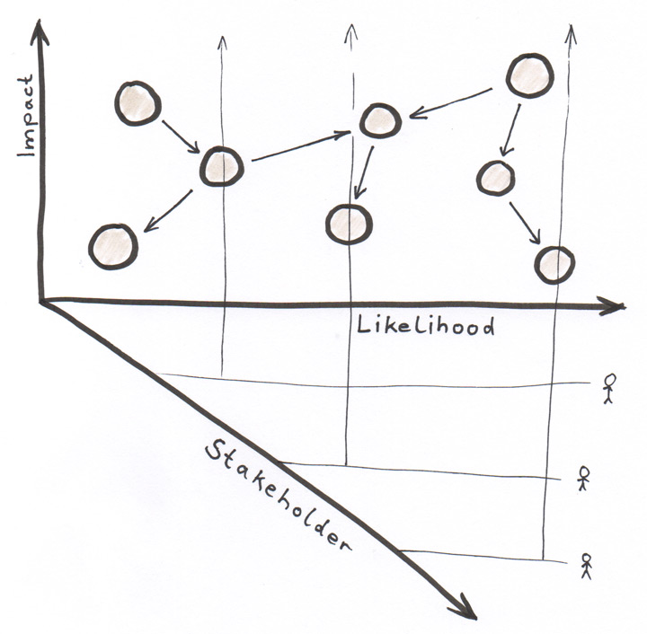

Last week I attended Dan North’s workshop “Testing Faster”. Dan North is the originator of the term *Behavior Driven Development* (BDD). The whole workshop was amazing but there was one thing which really surprised me. Since BDD is basically another way of Test Driven Development (TDD), I would have expected that having a high test coverage was one of Dan’s goals when writing software. But what I learned was that he actually doesn’t care about the overall test coverage. He explained that in a very convincing way. In this article I wrote down what I learned about the test coverage.

## The Meaning of Test Coverage
The test coverage (also known as code coverage) is a number which tells you how much of your production code is covered by automated tests. If you don’t have any automated tests you have a test coverage of 0%. If every single line of your production code is executed by at least one automated test you have a coverage of 100%. Having a high number might feel great but even 100% doesn’t mean that there are no bugs in your code. It only tells you whether the use cases which you have written tests for are working as expected or not.

## The Cost of Testing
Automated tests can save you a lot of money! They can detect bugs before they are deployed to the production system which can prevent big damage. They can also help you to design your code in a way that makes it easy to maintain and extend in the future. But writing tests is not for free. It takes time and that time could also be spent on other things. Dan calls it the opportunity costs. Don’t get me wrong on this point. I don’t say that tests are a bad idea. They are not. In fact, they can be very important. But I want to encourage you to think about what makes sense to test and what not.

## The Risk Plane
So how do we decide what to test? Imagine a software system which looks like this:

There are many components and dependencies between them. Now let’s add a coordinate system to the graph. The more a component is on the right side of the graph the more likely it is to break. The more impact a failure in a certain component would have the higher we draw it on the vertical axis. Let’s take a look at the *risk plane*:

Now imagine that the test coverage of our system is 80%. Sounds like quite a good number. But look at the component on the top right corner. It is very likely that something will break in that component and the impact of a failure would be very high. Having that in mind, 80% is actually quite low for that part. On the other hand: The component on the lower left corner is very unlikely to break. And even if it breaks the impact will be low. So does it really make sense to spend so much time on testing this component in order to keep the test coverage high? Wouldn’t it be more useful to spend our time on writing tests for the components on the upper right corner or even to build new features? Every hour we spend on coding means money invested by our company. It is our responsibility as software developers to make reasonable decisions on how to spend that money.

## The Stakeholder Planes
Dan North says, “The goal of testing is to increase the confidence for stakeholders through evidence”. *Evidence* can be provided by our tests. *Increasing* doesn’t necessarily mean to reach the 100%. It requires some pragmatism to decide how much effort to spend in which situation. And who are the persons we are doing that for? It’s the *stakeholders*! It is not enough to tell them that we are great developers and everything is going to be alright. We should give them evidence. They should know which behavior is assured by tests. Developers tend to have a blind spot. Most developers think that their code is great and works. But the stakeholders do usually not have that much confidence in the developers which is why they need the evidence.

Often there are many kinds of stakeholders. They can be users, people from the security department, the customer support and many others. We can build software which is very unlikely to fail but if it is illegal we still cannot ship it. This is why we have to extend our model with another axis. We have to add planes for our stakeholders:

Usually, the stakeholders see the software from different perspectives. Sometimes aspects that you didn’t even think about are essential to them. Maybe it is extremely important that certain user roles must not access certain data. That would require a bigger testing effort. Talking to all kinds of your stakeholders is very helpful. Ask them what is the most important thing that you should concentrate on. On which part would they spend the most effort. If you do that with every stakeholder you will get a good idea of where to draw your components in the risk planes and how much testing effort to put on which component.

## The Pragmatic Way
What Dan North made really clear to me is that the test coverage doesn’t tell much about the quality of the software. 80% can be too little for one component and it can be a waste of time for another component. When we write code we should first understand our stakeholders. What is really important? We should estimate the impact and the likelihood of potential bugs and pragmatically decide how much effort to spend on which component. We have to keep in mind that we are paid for our work. Every hour that we spend on coding costs money. It’s our responsibility as professional software developers to spend that money wisely.
