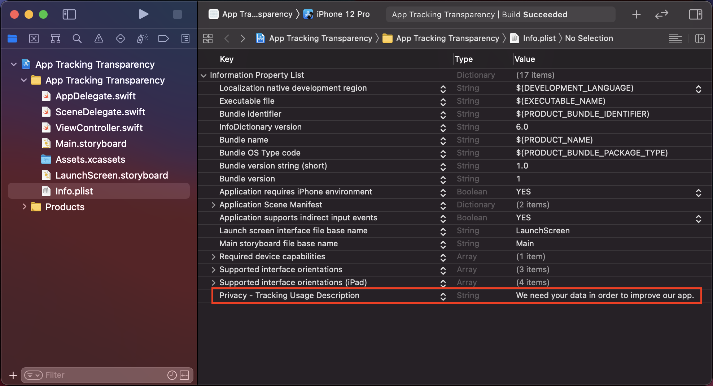
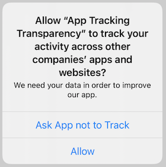

Apple just released some [updates](https://developer.apple.com/news/?id=3ozbk628) on their App Store Review Guideline. I guess for most app developers the most relevant point in this update is this one:

> You must receive explicit permission from users via the App Tracking Transparency APIs to track their activity.

I think it's a good step towards more transparency and data protection but it also means some extra work for us developers. In this blog post I explain how to use Apple's *App Tracking Transparency APIs* in three simple steps.


## Step 1: Set up Privacy Key in Info.plist

The first thing we have to do is adding a new key in our app's Info.plist file. The `NSUserTrackingUsageDescription` key provides a message which is displayed along with the tracking authorization dialog. You can use it to explain the user why the tracking is necessary. So go ahead and add the key, like illustrated in this screen shot:



NOTE: Make sure to have at least Xcode 12.4 installed in order to use the App Tracking Transparency APIs.

## Step 2: Request Tracking Authorization

Next we can implement the dialog for requesting the user's permission for tracking. Here is how we do it:

```swift
ATTrackingManager.requestTrackingAuthorization { (status) in
            
}
```

When the above code is executed the user will see the following dialog:



## Step 3: Determining the Authorization Status

Finally, we can find out if the user has granted us permissions  for tracking or not. We modify our previous code like this:

```swift
import AppTrackingTransparency

...

ATTrackingManager.requestTrackingAuthorization { (status) in
    switch status {
    case .authorized:
        print("Yeah, we got permission :)")
    case .denied:
        print("Oh no, we didn't get the permission :(")
    case .notDetermined:
        print("Hmm, the user has not yet received an authorization request")
    case .restricted:
        print("Hmm, the permissions we got are restricted")
    @unknown default:
        print("Looks like we didn't get permission")
    }
}
```

Note that we have to import `AppTrackingTransparency` in order to use `ATTrackingManager`.


## Summing Up

That's it. It's not very complicated. However, the challenge is now to only do the tracking if you got the permission and also to find a way to deal with a denied permission.
